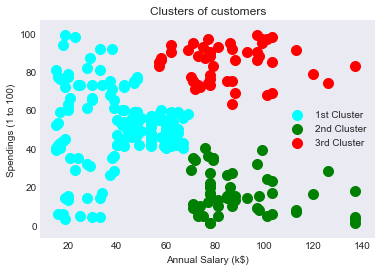
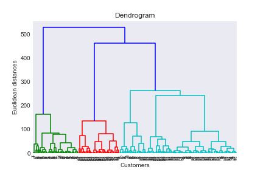

# *Customer Segmentation Methods*

*This step is one of few steps in Data Science Porjects. To get insight of unstructured data, clustering often use in the field. The data consist of a e-commerce site that is serving customers by different products. They want to know if there is any specific behaviour in customers. After analysis we came to 3 types of different behaviour is in all customers. We can detect them, treat them accordingly & give best oppurtunity to buy from site to their tastes.*

Used Algorithms
  - K-means 
  - Agglomerative clustering

### *Result*
*Got 3 types of customers according to their behaviour. 
   

### Get touch with me

Connect- [Linkedin](https://linkedin.com/in/rakibhhridoy)  
Website- [RakibHHridoy](https://rakibhhridoy.github.io) 
